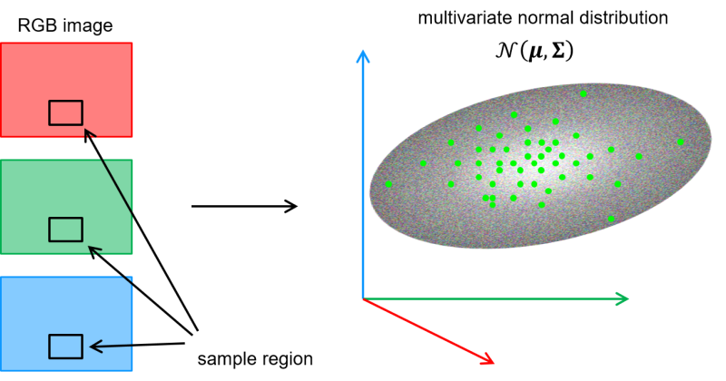
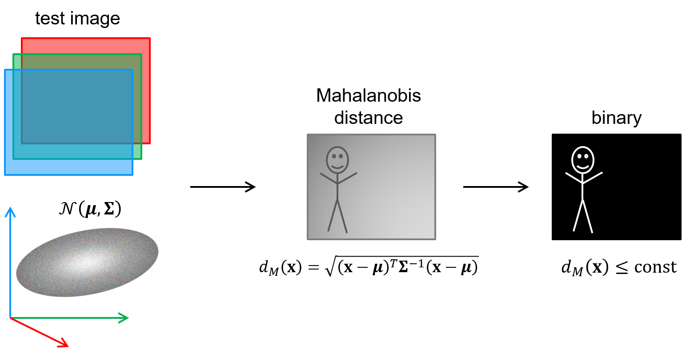

# Step 1: Get an overview
Today we will implement and experiment with a simple segmentation method based on colour.
You can choose to work on images from your camera or on the provided [videos captured from an autonomous vehicle](../README.md).

We will begin by using the measured colour ([B,G,R] in OpenCV) as a 3-dimensional *feature vector* for each pixel.
Pixels with similar colours should be distributed in the same region of the 3-dimensional feature space.
We can represent this distribution by training a *multivariate normal model* on feature samples.
This allows us to measure how well new samples fit with this distribution by computing the *Mahalanobis distance*.

Doing so for all pixels in an image gives us an image of Mahalanobis distances between each pixel and the feature model.
By thresholding the Mahalanobis distance image we get a binary image indicating segments of pixels that are sufficiently similar to the training samples.

This is a simplistic approach, but the method can naturally be generalised and improved:

- We can transform the colours to another, better suited colour space.
- Each pixel can be represented with more features than just colour.
- The set of pixels that we want to segment out might not fit well with a multivariate normal distribution, so we can
 use a more flexible distribution instead.

  
## Main steps in this lab
1. **Estimate a multivariate normal distribution** by training on the feature samples in a predefined sample region.

  

2. **Compute Mahalanobis images** by calculating the Mahalanobis distance between each pixel and the model.

3. **Detect similar pixels** by thresholding the Mahalanobis image.
The final binary image is the result of our segmentation method.

  
 
4. We will also implement **an adaptive segmentation procedure**, that gradually updates the model based on how the pixels in the sampling region change over time. 

## Introduction to the project source files
We have chosen to distribute the code on the following modules:
- [**lab_segmentation.py**](../lab_segmentation.py)

  Contains the main loop of the program, the unfinished model and some other functions you will complete.
  
  Note in particular that:
    - Keypress <kbd>space</kbd> extracts samples from the sampling region and estimates a new multivariate normal model
    - Keypress <kbd>o</kbd> turns thresholding by Otsu's method on/off (Default is off)
    - Keypress <kbd>a</kbd> turns the adaptive model on/off (Default is off)
    - Keypress <kbd>q</kbd> exits the program
  
  If you want to work on images from one of the videos instead of from the camera, you can change to code from `video_source = 0` to `video_source = "your_video_file.avi"`.
  
  You might also want to adjust the frame delay time on the line `key = cv2.waitKey(1)` (see [waitKey()])

- [**common_lab_utils.py**](../common_lab_utils.py)

  This module contains utility functions and classes that we will use both in the lab and in the solution.
  Please take a quick look through the code.
 
- [**solution_segmentation.py**](../solution_segmentation.py)

  This is our proposed solution to the lab.
  Please try to solve the lab with help from others instead of just jumping straight to the solution ;)
  

  Please continue to the [next step](2-implement-simple-color-based-segmentation.md).

[waitKey()]: https://docs.opencv.org/4.9.0/d7/dfc/group__highgui.html#ga5628525ad33f52eab17feebcfba38bd7